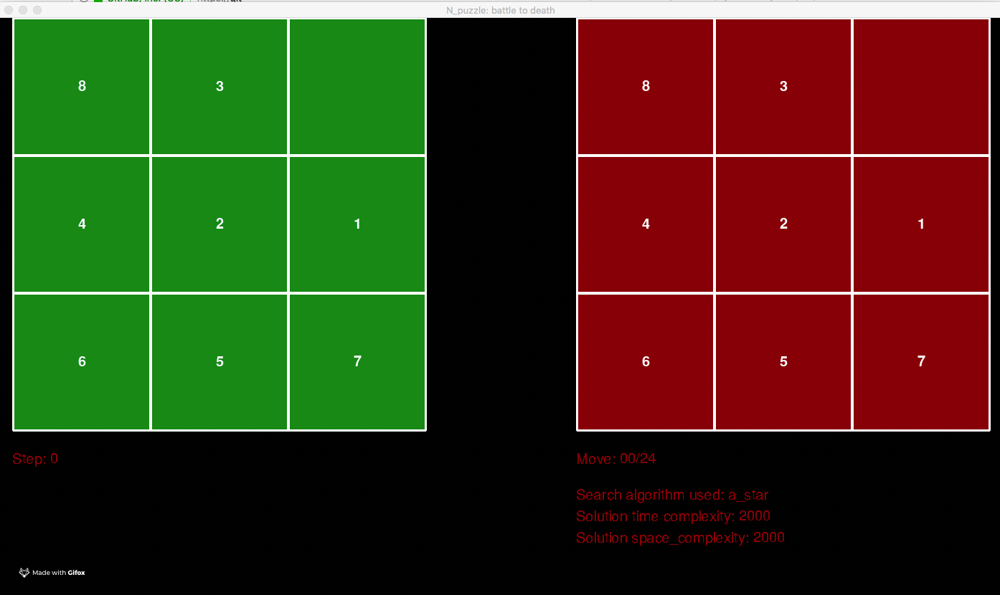

# n-puzzle

N-puzzle solver in python 3.7.  
A set of options is given:
- Choose which is the targeted goal (snail or linear). A pretreatment checks if input has a solution or not before searching (using a function defining an invariant).
- Choose which algorithm to choose among [A*, IDA*, Greedy, uniform-cost]
- Choose which heuristic to use (not relevant for uniform_cost algorithm) among [misplaced_tiles, manhattan, improved_manhattan]
- Choose to have a visual result or not and if the visual should only display the solution or let the player try his luck against the computer

42 project made with nvergnac.

## Objective

Create a program which solves N-puzzles (https://en.wikipedia.org/wiki/15_puzzle).


### How to run the program
You must have python3 installed.  
Run `source set_env.sh`. It will crete a virtualenv and install the necessary packages.  
If you would like some music and a 'swap sound' in your visual, put a 'music.mp3' and a 'sound.wav'
file in your Downloads folder.

Run the program as follow:

<pre>
npuzzle.py [-h] -f FILE [-s {manhattan,misplaced,improved_manhattan}]
           [-a {a_star,ida_star,greedy,uniform_cost}] [-v] [-t] [-visu]
           [-visumode {solution,fight}] [-p {classic,snail}]
</pre>

The only required input is the input file (`-f filepath`). The rest are options.


### Input file
Input file must be of this form:

3  
1 2 3  
4 5 6  
7 8 0  
\# Comments

On the first line the size n on the n-puzzle.  
On the following lines the n_puzzle with n numbers separated by spaces.


### Options
<pre>
-h, --help            show this help message and exit
-f FILE, --file FILE  Name of the file containing the npuzzle. File must be absolute path.
-s {manhattan,misplaced,improved_manhattan}, --heuristic {manhattan,misplaced,improved_manhattan}
                      Choose the heuristic to be used.
-a {a_star,ida_star,greedy,uniform_cost}, --algorithm {a_star,ida_star,greedy,uniform_cost}
                      Choose the algorithm to be used.
-v, --verbosity       Toggle verbose mode.
-t, --time            Show the time needed to resolve the npuzzle.
-visu, --visual       Toggle Visual mode.
-visumode {solution,fight}, --visual_mode {solution,fight}
                      Define the type of visual.
-p {classic,snail}, --puzzle {classic,snail}
                      Choose which kind of puzzle you would like to solve.
</pre>

### Results displayed
The program will search for the goal and return the path to solve a solution:
- The number of steps needed for the solution.
- The time and space complexity of the algorithm used to solve it.
- The steps to solve the puzzle

If the visualization option is triggered, a visual result is displayed. (2 options either just the computer solution or a 
fight mode where the player can try to beat the computer)





## Unit tests
Running ```python test_npuzzle.py``` will run the unit tests written for the program. 
Those tests are mainly for heuristic, actions on puzzle (sliding a tile) and pre_check if the puzzle has a solution.
It is also included in CI.

## General learning on N-puzzle
Show some results...
